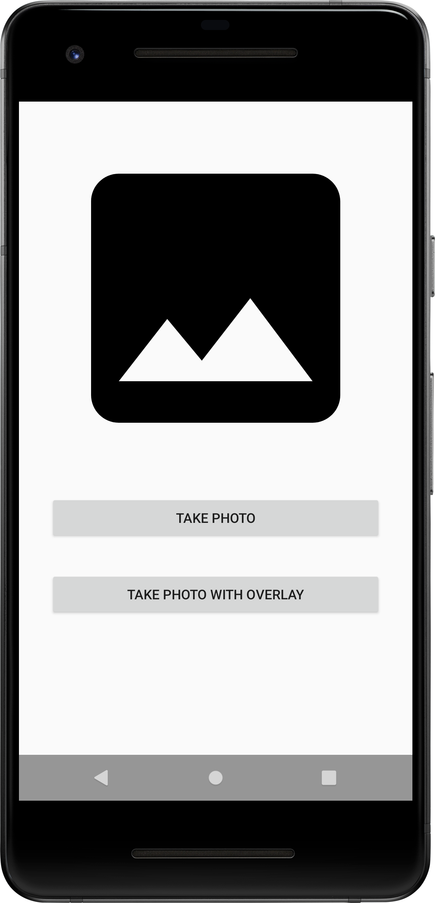
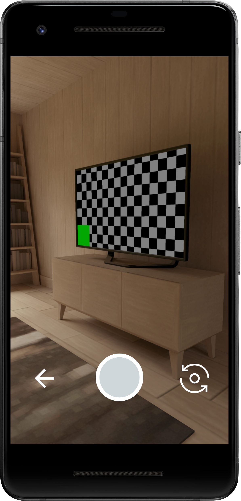
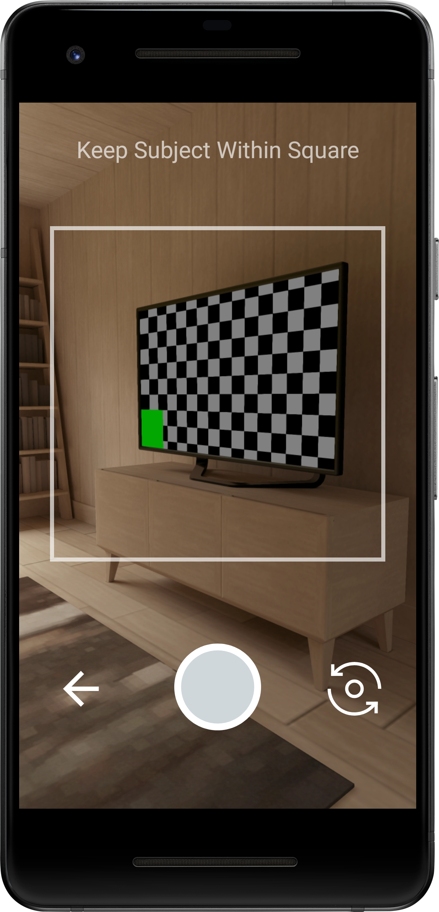

NOTE: This is an early prototype. Do not use in production.

# CameraX Activity
This library implements an Activity that can be used to capture photos without the need to implement
any code to control the device's camera. Instead, you can launch an intent that will open the
Activity from this library and receive back the resulting photo captured by the user.


## Usage
#### 1. Import the module in build.gradle
```
dependencies {
    implementation "androidx.camera:camera-activity:1.0.0"
}
```
NOTE: This library is not on Maven yet. Instead, download the code, compile an AAR file and add it
to your project using [these instructions](https://stackoverflow.com/a/34919810).

#### 2. Add the activity to the app's manifest
```
<activity android:name="androidx.camera.activity.PhotoActivity">
    <!-- Configuration via meta-data tags can be added here -->
</activity>
```

#### 3. Invoke the activity via Intent
```
val photoIntent = Intent(MediaStore.ACTION_IMAGE_CAPTURE)
startActivityForResult(photoIntent, PHOTO_REQUEST_CODE)
```

#### 4. Receive the result
```
override fun onActivityResult(
    requestCode: Int,
    resultCode: Int,
    data: Intent
) {
    if (requestCode == PHOTO_REQUEST_CODE && resultCode == RESULT_OK) {
        val imageUri = data.extras.get(CameraActivity.IMAGE_URI) as Uri
        // Do something with the image URI
    }
}
```


## Features
The Activity implemented by this library is very simple and has the single goal of capturing a photo
so the result can be sent back to the launching activity. It is very similar to the intent-based
mechanism described in [the Android documentation]
(https://developer.android.com/training/camera/photobasics), but there are a few differences:
1. As of Android P, users can select any app to be the default camera app, which may not properly
   implement this feature. Even worse, it's possible that on some devices there is no camera app at
   all! Using this Activity provides a working implementation regardless of which camera app is the
   default in the user's device.
2. There is no consistent behaviour across camera apps, even when they implement this feature
   correctly. Using this activity lets you have a consistent experience, including adding an overlay
   with your own instructions or branding as part of the photo-capture user flow.
3. By default, the documented intent-based mechanism sends a Bitmap back to the launching activity.
   Instead, this activity saves the photo in the app's internal storage, and sends back its URI.


## Customizing the Activity
By design, the activity is very simple so there are few potential settings to customize.
Customizations are set in one of two ways:
1. Using Manifest metadata
    ```
    <activity name="androidx.camera.activity.PhotoActivity>
        <meta-data
            android:name="androidx.camera.activity.PhotoActivity.CAMERA_SWITCH_DISABLED"
            android:value="true" />
    </activity>
    ```
2. Using Intent extras
    ```
    startActivityForResult(Intent(this, PhotoActivity::class.java).apply {
        putExtra(PhotoActivity.CAMERA_SWITCH_DISABLED, true)
    }, PHOTO_REQUEST_CODE)
    ```


## Examples
See the `sample` subfolder for a project implementing this activity.







